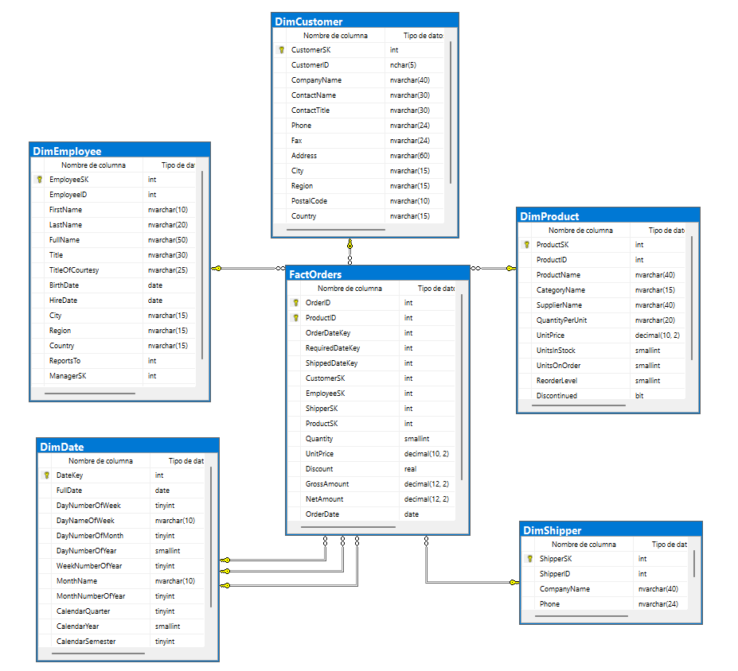
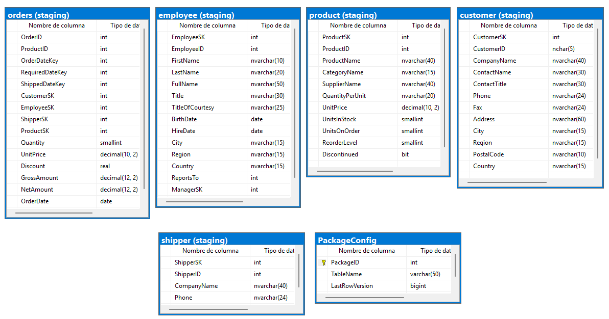

#  Northwind Data Warehouse
# 👥 Integrantes del grupo

| Apellido y Nombre |
| :--- |
| Ayala Torrico Adriana Nicole |
| Canaviri Yanahuaya Alexander Sergio |
| Fuentes Rios Beatriz |
| Poma Limache Alisson Daniela |
| Sotillo Sanchez Luis Antonio | 

---

# 📋 Descripción del proyecto

Dominio de negocio: Ventas y distribución

El sistema gestiona el flujo transaccional completo de una empresa distribuidora mediante una base de datos en 3FN.
Permite administrar de forma centralizada catálogos de productos, carteras de clientes y redes de empleados por territorios , su diseño está optimizado para asegurar la integridad de los datos en procesos complejos de facturación y despacho.

Componentes principales:

✅ OLTP (NorthWindOLTP)
✅ DW (NorthWindDW)
✅ ETL (NorthWindETL)
✅ DACPAC
---
## Reglas de Negocio 
---

## 1. Reglas de Clientes (Customers)

| ID | Regla de Negocio | Tipo | Implementación |
| :--- | :--- | :--- | :--- |
| **RN-CUST-01** | Todo cliente debe tener un identificador único de 5 caracteres (alfanumérico). | Estructural | `CustomerID NCHAR(5) NOT NULL PRIMARY KEY` |
| **RN-CUST-02** | El nombre de la empresa del cliente es obligatorio. | Obligatoria | `CompanyName NVARCHAR(40) NOT NULL` |

---

## 2. Reglas de Productos (Products)

| ID | Regla de Negocio | Tipo | Implementación |
| :--- | :--- | :--- | :--- |
| **RN-PROD-01** | El nombre del producto es obligatorio. | Obligatoria | `ProductName NVARCHAR(40) NOT NULL` |
| **RN-PROD-02** | El precio unitario no puede ser negativo. | Integridad | `CHECK ([UnitPrice] >= 0)` |
| **RN-PROD-03** | Un producto puede ser discontinuado (no se puede vender después de discontinuado). | Estado | `Discontinued BIT NOT NULL` |

---

## 3. Reglas de Pedidos (Orders)

| ID | Regla de Negocio | Tipo | Implementación |
| :--- | :--- | :--- | :--- |
| **RN-ORD-01** | Un pedido debe estar asociado a un cliente (opcionalmente puede no tenerlo para pedidos anónimos). | Relacional | `FK_Orders_Customers` |
| **RN-ORD-02** | La fecha requerida es la fecha prometida al cliente. | Semántica | `RequiredDate DATETIME NULL` |

---

## 4. Reglas de Empleados (Employees)

| ID | Regla de Negocio | Tipo | Implementación |
| :--- | :--- | :--- | :--- |
| **RN-EMP-01** | El nombre y apellido del empleado son obligatorios. | Obligatoria | `LastName NVARCHAR(20) NOT NULL`,<br>`FirstName NVARCHAR(10) NOT NULL` |
| **RN-EMP-02** | Un empleado puede reportar a otro empleado (relación jerárquica). | Autorreferencial | `FK_Employees_Employees (ReportsTo)` |

---

## 5. Reglas de Transportistas (Shippers)

| ID | Regla de Negocio | Tipo | Implementación |
| :--- | :--- | :--- | :--- |
| **RN-SHIP-01** | Cada transportista debe tener un identificador único numérico. | Estructural | `ShipperID INT NOT NULL PRIMARY KEY` |
| **RN-SHIP-02** | El nombre de la empresa transportista es obligatorio. | Obligatoria | `CompanyName NVARCHAR(40) NOT NULL` |
| **RN-SHIP-03** | El teléfono de contacto puede quedar registrado de manera opcional. | Formato | `Phone NVARCHAR(24) NULL` |

---
## 6. Reglas de  Fechas (Date)

| ID | Regla de Negocio | Tipo | Implementación |
| :--- | :--- | :--- | :--- |
| **RN-DATE-01** | Cada registro de fecha debe tener una clave sustituta única (Surrogate Key) de tipo entero para el mapeo en el Data Warehouse. | Estructural | `DateKey INT NOT NULL PRIMARY KEY` |
| **RN-DATE-02** | El campo de fecha completa en formato estándar es obligatorio para permitir filtros temporales continuos. | Obligatoria | `FullDate DATE NOT NULL` |
| **RN-DATE-03** | Los atributos derivados (número de día, nombre del mes, año, trimestre) deben estar precalculados para optimizar el rendimiento de las consultas analíticas. | Rendimiento | `DayNumberOfWeek TINYINT`, `MonthName NVARCHAR(15)`, `CalendarYear INT NOT NULL`|

---

## 7. Reglas de Control de Concurrencia

| ID | Regla de Negocio | Tipo | Implementación |
| :--- | :--- | :--- | :--- |
| **RN-CC-01** | Toda tabla debe tener un campo `rowversion` (`timestamp`) para control de concurrencia optimista. | Técnica | Columna `rowversion timestamp NULL` en todas las tablas |

---
## 📊 Modelo de Datos

A continuación, se presentan los diagramas que representan la estructura técnica del proyecto, desde su origen transaccional hasta su destino analítico.

### 📑Modelo de Datos NorthWind_DW


### 📑Modelo de Datos NorthWind_DW (Tablas Staging)


### 📑Diagrama ER


### 📊 Modelo Dimensional (Data Warehouse)

Esta sección detalla la estructura del Almacén de Datos, organizada en una tabla de hechos central y sus dimensiones correspondientes.

## 🗺️ Arquitectura de la Solución

Se implementó un **Modelo Estrella ** orientado al análisis de ventas.

#### 📈 Tabla de Hechos: `FactOrders`
| Campo | Descripción | Tipo |
| :--- | :--- | :---: |
| 📦 `Quantity` | Cantidad de productos vendidos | Métrica |
| 💰 `UnitPrice` | Precio unitario del producto | Métrica |
| 📉 `Discount` | Descuento aplicado a la venta | Métrica |
| 💵 `LineTotal` | Total de la venta (Calculado) | Métrica |

#### 🖇️ Tablas de Dimensión
| Dimensión | Contenido Detallado | Enfoque |
| :--- | :--- | :--- |
| 👥 `DimCustomer` | Información completa y segmentación de **Clientes**. | Atributos |
| 👔 `DimEmployee` | Perfiles de **Empleados y Vendedores** por región. | Atributos |
| 🍎 `DimProduct` | Catálogo de **Productos, Categorías y Proveedores**. | Atributos |
| 🚚 `DimShipper` | Datos de las **Empresas de Envío** y logística. | Atributos |
| 📅 `DimDate` | Eje temporal para análisis (Año, Mes, Día, etc.). | Tiempo |

---
### ⚙️ Flujo del Proceso ETL (Extract, Transform, Load)

El movimiento y refinamiento de los datos se gestionó mediante scripts avanzados de **SQL Server**, siguiendo estas etapas:

| Fase | Acción | Descripción |
| :--- | :--- | :--- |
| 📥 **Extracción** | `Source: OLTP` | Obtención de datos crudos desde la base original **Northwind**. |
| 🔄 **Transformación** | `Data Cleaning` | Limpieza de registros, normalización y conversión de tipos de datos. |
| 📤 **Carga** | `Target: DW` | Inserción optimizada de la información en el **Data Warehouse**. |

---

### 🛠️ Especificaciones Técnicas de Implementación

Para asegurar la calidad de la información analítica, se aplicaron las siguientes reglas de ingeniería:

* **Consistencia Temporal:** Se implementaron funciones de conversión `CAST` y `CONVERT` para alinear todas las fechas con la dimensión de tiempo.
* **Integridad de Datos:** Uso estratégico de `JOINs` complejos entre tablas del OLTP para consolidar métricas precisas en la tabla de hechos.
* **Garantía de Calidad:** Validación de integridad referencial para asegurar que cada hecho (Fact) esté correctamente vinculado a sus dimensiones.
  
---

##  Modelo OLTP

### 🗄️ Diccionario de Entidades (NorthWind OLTP)

| Entidad | Propósito Principal | Campos Clave |
| :--- | :--- | :--- |
| 👥 **Customers** | Almacena la información de contacto y ubicación de los **clientes**. | `CustomerID`, `CompanyName` |
| 👔 **Employees** | Registro del **personal de ventas** y su jerarquía operativa. | `EmployeeID`, `LastName`, `FirstName` |
| 📦 **Products** | Catálogo detallado de **artículos**, precios y niveles de stock. | `ProductID`, `ProductName` |
| 📑 **Orders** | Encabezados de **pedidos** que vinculan clientes, empleados y fechas. | `OrderID`, `OrderDate`, `CustomerID` |
| 🚚 **Shippers** | Listado de **empresas logísticas** encargadas de las entregas. | `ShipperID`, `CompanyName` |

---

### ⚡ Objetos de Control y Lógica (Stored Procedures)

| Objeto Técnico | Función en el Proyecto |
| :--- | :--- |
| 🔄 **RowVersionControl** | Utiliza `timestamp` para detectar qué datos han cambiado desde la última carga. |
| ⚙️ **GetChanges Procedures** | Procedimientos específicos (`GetCustomerChanges`, etc.) para la extracción incremental. |

Normalizacion Aplicada

1FN: Valores atómicos, sin grupos repetidos, clave primaria definida en cada tabla.

2FN: Todos los atributos dependen de la totalidad de la clave primaria. En OrderDetails, Quantity, UnitPrice y Discount dependen del par OrderID + ProductID.

3FN: Sin dependencias transitivas. CategoryName vive en Categories (no en Products); datos del proveedor en Suppliers (no en Products).

##  Data Warehouse (DW)

Contiene el modelo estrella y scripts de carga:

---

### 📊 Especificaciones del Data Warehouse (NorthwindDW)

Esta sección detalla la configuración técnica y la arquitectura dimensional del repositorio analítico diseñado para **Business Intelligence**.

#### 🚀 Características Principales
| Aspecto | Detalle |
| :--- | :--- |
| 🏗️ **Modelo** | Esquema estrella (**Star Schema**) optimizado para consultas analíticas. |
| 🎯 **Grano** | Una fila por cada línea de detalle de pedido (`OrderID` + `ItemID`). |
| 📋 **Tablas** | 8 tablas totales (1 Fact + 6 Dimensiones + 1 Config). |
| 🔢 **Registros FactOrders** | ~2,155 registros procesados con éxito. |
| 💾 **Base de datos** | `NorthwindDW` |
| 📜 **Script de creación** | `scripts/02_DW_Schema_final.sql` |

---

#### 🏛️ Estructura de Tablas — `NorthwindDW/dbo/Tables/`

| Archivo | Tabla | Tipo | Descripción |
| :--- | :--- | :--- | :--- |
| 📈 `FactOrders.sql` | **FactOrders** | **Hecho** | Métricas clave: `Quantity`, `UnitPrice`, `Discount`, `GrossAmount`, `NetAmount`. |
| 👥 `DimCustomer.sql` | **DimCustomer** | **Dimensión** | Perfiles de clientes: `CompanyName`, `City`, `Country`, `Region`. |
| 📅 `DimDate.sql` | **DimDate** | **Dimensión** | Eje temporal: `Day`, `Month`, `Quarter`, `Year` (Histórico 1996–1998). |
| 👔 `DimEmployee.sql` | **DimEmployee** | **Dimensión** | Staff de ventas: `FullName`, `Title` y jerarquía organizacional. |
| 🍎 `DimProduct.sql` | **DimProduct** | **Dimensión** | Catálogo: Productos, categorías y proveedores desnormalizados. |
| 🚚 `DimShipper.sql` | **DimShipper** | **Dimensión** | Logística: Empresas de transporte y datos de contacto. |
| ⚙️ `PackageConfig.sql` | **PackageConfig** | **Config** | Control técnico para la carga incremental (`LastRowVersion`). |

---

### ⚡ Lógica de Transformación y Carga (Stored Procedures)

Para garantizar la integridad y eficiencia del flujo de datos, se implementaron procesos automatizados:

* 🔄 **Sincronización (Merge):** Los procedimientos `DW_MergeDim...` gestionan la lógica de **SCD (Slowly Changing Dimensions)** para insertar nuevos registros y actualizar cambios.
* 📈 **Control Incremental:** Uso de `GetLastPackageRowVersion` para extraer únicamente los cambios nuevos del OLTP, optimizando el tiempo de ejecución.
* 🏗️ **Capa de Staging:** Implementación del esquema `[staging]` como zona de preparación y limpieza de datos (*Data Cleansing*) antes de la carga final.

Diagrama del Modelo Estrella


---

### 2. Ejecutar ETL
---

## 🔄 Proceso ETL — NorthwindETL (SSIS)

El proyecto ETL fue desarrollado con **SQL Server Integration Services (SSIS)** y automatiza la extracción, transformación y carga de datos desde `NorthWindOLTP` hacia `NorthWindDW`.

### 📦 Paquetes SSIS

| Archivo | Tabla destino | Descripción |
| :--- | :--- | :--- |
| `Customer.dtsx` | `DimCustomer` | Carga clientes desde **Customers**. |
| `Employee.dtsx` | `DimEmployee` | Carga empleados desde **Employees**. |
| `Products.dtsx` | `DimProduct` | Carga productos con categoría y proveedor. |
| `Shipper.dtsx` | `DimShipper` | Carga transportistas desde **Shippers**. |
| `Sales.dtsx` | `FactOrders` | Carga hechos de ventas desde ** Orders**. |

 **Orden de ejecución obligatorio:** Las dimensiones deben cargarse antes que la tabla de hechos. `Orders.dtsx` debe ejecutarse siempre al final.

### 🛠️ Consideraciones técnicas:

* Se utilizó conversión de fechas (**CAST**) para asegurar consistencia con la dimensión tiempo.
* Se aplicaron **JOINs** entre tablas OLTP para poblar correctamente la tabla de hechos.
* Se garantizó la **integridad referencial** entre dimensiones y hechos.
---

## 🔄 Proceso ETL — NorthwindETL (SSIS)

El proceso de carga de datos se realizó mediante SQL Server Integration Services (SSIS), automatizando la extracción, transformación y carga desde **NorthWindOLTP** hacia **NorthWindDW**.

### 🗺️ Flujo de Datos (Arquitectura)

```text
 NorthWindOLTP (Fuente)
       │
       ├─── Customer.dtsx ────▶ DimCustomer
       ├─── Employee.dtsx ────▶ DimEmployee
       ├─── Products.dtsx ────▶ DimProduct
       ├─── Shipper.dtsx  ────▶ DimShipper
       │        └─ (DimDate se genera desde script SQL)
       │
       └─── Orders.dtsx ───────▶ FactOrders
                                   │
                            NorthWindDW (Destino)


```
## Ejecucion del ETL 


# ⚙️ Instrucciones de Despliegue
### 📜 Opción A: 

Requisitos: SQL Server + Integration Services + Visual Studio con SSDT

Para garantizar la integridad referencial del **Data Warehouse**, ejecute los paquetes de **SSIS** estrictamente en el siguiente orden:

| Paso | Paquete | Acción |
| :--- | :--- | :--- |
| 1️⃣ | `Customer.dtsx` | Carga de Clientes |
| 2️⃣ | `Employee.dtsx` | Carga de Empleados |
| 3️⃣ | `Products.dtsx` | Carga de Productos y Categorías |
| 4️⃣ | `Shipper.dtsx` | Carga de Transportistas |
| 🏁 | **`Orders.dtsx`** | **Carga de Hechos (FactOrders)** |

### 📜 Opción B: 
Ejecutar en el siguiente orden estricto para asegurar la integridad de los datos:
1. 📁 `scripts/01_OLTP_Northwind_Full.sql` — Crear y poblar origen.
2. 📁 `scripts/02_DW_Schema_final.sql` — Crear esquema del DW.
3. 📁 `scripts/04_Poblar_Dimensiones.sql` — Cargar datos maestros.
4. 📁 `scripts/03_Carga_fact_Orders.sql` — Cargar hechos (**Siempre al final**).

### 📦 Opción C: DACPAC
Ideal para entornos de producción en **SQL Server Management Studio (SSMS)**:
1. Clic derecho en **Databases** ➔ **Deploy Data-tier Application...**
2. Seleccionar `dacpac/Northwind.dacpac` para desplegar el **OLTP**.
3. Repetir el proceso con `dacpac/Northwind_DW.dacpac` para el **DW**.
---
## ✅ Validación de datos
```sql
-- Validar que los registros cargados coincidan con el origen
SELECT COUNT(*) AS Clientes FROM NorthwindOLTP.dbo.Customers;      -- Esperado: 91
SELECT COUNT(*) AS Pedidos FROM NorthwindOLTP.dbo.Orders;          -- Esperado: 830
SELECT COUNT(*) AS Detalles FROM NorthwindOLTP.dbo.OrderDetails;    -- Esperado: 2,155

-- Validar integridad en el DW
SELECT COUNT(*) AS FactOrders FROM NorthWindDW.dbo.FactOrders;   -- Esperado: 2,155

```
## 📋 Reglas OLAP / Analíticas (Business Intelligence)

Para garantizar la integridad del modelo dimensional y la eficiencia del proceso analítico, se implementaron las siguientes reglas de negocio en el Data Warehouse:

| ID | Regla de Negocio | Tipo | Implementación / Componentes |
| :---: | :--- | :---: | :--- |
| **RN-BI-01** | La tabla de hechos `FactOrders` debe tener claves sustitutas (SK) para todas las dimensiones. | 🏗️ <br>`Estructural` | Claves subrogadas implementadas:<br>• `CustomerSK`, `ProductSK`, `EmployeeSK`<br>• `ShipperSK`, `OrderDateSK`<br>• `RequiredDateSK`, `ShippedDateSK` |
| **RN-BI-02** | Las métricas de ventas deben precalcularse para optimizar los tiempos de respuesta en reportes. | ⚡ <br>`Rendimiento` | Campos calculados nativos en la tabla de hechos:<br>• `DiscountAmount`<br>• `NetOrders`<br>• `GrossRevenue` |
| **RN-BI-03** | El análisis temporal requiere una dimensión dedicada con atributos detallados (año, trimestre, mes, día, fin de semana). | 📊 <br>`Analítica` | Dimensión física: `DimDate` |
| **RN-BI-04** | Las claves de negocio originales de los sistemas transaccionales deben conservarse para auditoría. | 🔍 <br>`Trazabilidad` | Columnas de linaje `OrderID` y `ProductID` mapeadas directamente en `FactOrders`. |
| **RN-BI-05** | Los datos deben ser extraídos y centralizados en un área temporal antes de la transformación final. | 🔄 <br>`ETL` | Aislamiento de carga mediante el esquema `staging`. |
| **RN-BI-06** | El sistema debe identificar de forma automatizada los nuevos registros para optimizar la ventana de carga. | ⚙️ <br>`ETL` | Control de delta mediante tabla `PackageConfig` evaluando la columna `LastRowVersion`. |

---
# 📦 Gestión de Esquema con DACPAC

Este proyecto utiliza **SQL Server Data Tools (SSDT)** en Visual Studio para la gestión del ciclo de vida de la base de datos, permitiendo un despliegue consistente y versionado del esquema del Data Warehouse.

---

## 🏗️ Estructura del Proyecto DACPAC

| Componente | Detalle |
| :--- | :--- |
| 🛠️ **Herramienta** | Visual Studio (SQL Server Data Tools - SSDT) |
| 📂 **Ubicación** | `NorthWind_Project/` |
| 📦 **Artefacto** | Archivo `.dacpac` (Data-tier Application Package) |

---

##  Tecnologías Utilizadas
* SQL Server
* SQL Server Management Studio (SSMS)
* Visual Studio 2026 (SSDT)
* GitHub
