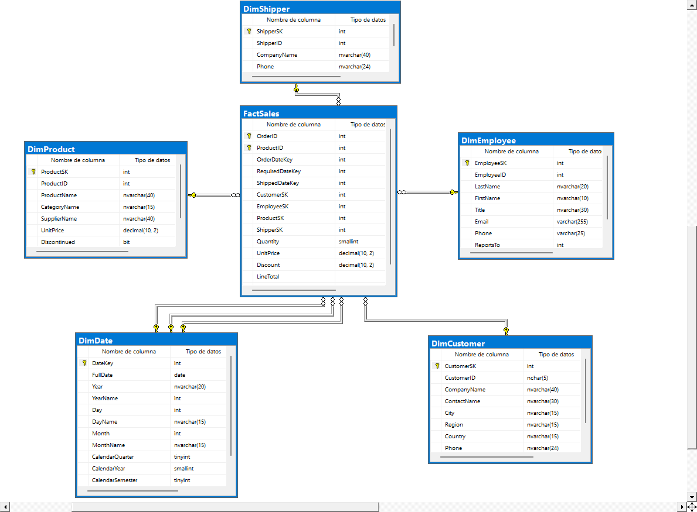
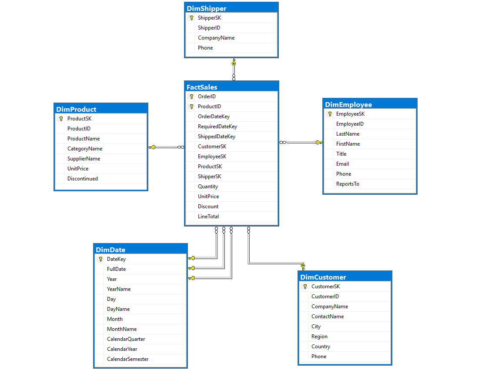

#  Northwind Data Warehouse
Integrantes :

| Apellido y Nombre |
| :--- | :--- |
| Ayala Torrico Adriana Nicole |
| Poma Limache Alisson Daniela  |
| Sotillo Sanchez Luis Antonio |
| Fuentes Rios Beatriz |
| Canaviri Yanahuaya Alexander Sergio |

**Módulo 2: Arquitectura de Datos  
**Fuente de datos:** NorthWind (SQL Server)  

---

##  Descripción del Proyecto

Este proyecto consiste en la transformación de una base de datos transaccional (OLTP) en un modelo analítico (Data Warehouse) utilizando el dataset **Northwind**.

---
## 📊 Modelo de Datos

A continuación, se presentan los diagramas que representan la estructura técnica del proyecto, desde su origen transaccional hasta su destino analítico.

### Data Model (Data Warehouse)

### Diagrama ER (Data Warehouse)

##  Arquitectura de la Solución

Se implementó un **Modelo Estrella ** orientado al análisis de ventas.

###  Tabla de Hechos
`FactSales`

* `Quantity` (Cantidad)
* `UnitPrice` (Precio Unitario)
* `Discount` (Descuento)
* `LineTotal` (Total de venta, calculado)

###  Tablas de Dimensión
* `DimCustomer`: Información de clientes.
* `DimEmployee`: Información de empleados/vendedores.
* `DimProduct`: Productos, categorías y proveedores.
* `DimShipper`: Empresas de envío.
* `DimDate`: Dimensión de tiempo (año, mes, día, etc.).

---

##  Proceso ETL (Extract, Transform, Load)

El proceso de carga de datos se realizó mediante scripts en SQL Server:

* **Extracción:** Datos obtenidos desde la base _Northwind_ (OLTP).
* **Transformación:** Limpieza, conversión de tipos y normalización.
* **Carga:** Inserción en el Data Warehouse.

###  Consideraciones técnicas:
* Se utilizó conversión de fechas (`CAST`) para asegurar consistencia con la dimensión tiempo.
* Se aplicaron `JOINs` entre tablas OLTP para poblar correctamente la tabla de hechos.
* Se garantizó la integridad referencial entre dimensiones y hechos.

---

##  Modelo OLTP

El sistema transaccional base corresponde a _Northwind_, el cual maneja:
* Clientes
* Pedidos
* Productos
* Empleados
* Envíos

📁 **Ubicación:** `OLTP/`

---

##  Data Warehouse (DW)

Contiene el modelo estrella y scripts de carga:

📁 **Ubicación:** `DW/`
* Scripts de creación de tablas.
* Scripts ETL (población de datos).
* Diagrama del modelo estrella.

---

##  Proyecto DACPAC

Se utilizó Visual Studio (SQL Server Data Tools - SSDT) para gestionar el esquema del Data Warehouse.

📁 **Ubicación:** `NorthWind_Project/`
📦 **Archivo generado:** `.dacpac`

---

##  Instrucciones de Despliegue

### 1. Usando DACPAC
1. Abrir **SQL Server Management Studio (SSMS)**.
2. Hacer clic derecho en el nodo "Bases de datos".
3. Seleccionar **"Implementar aplicación de capa de datos..."**
4. Cargar el archivo `.dacpac` desde la ruta `NorthWind_Project/bin/Debug/`.
5. Seguir el asistente.

### 2. Ejecutar ETL
Una vez desplegada la base de datos:

 Ejecutar el script de carga ubicado en:
`DW/` (script ETL)

---

##  Tecnologías Utilizadas
* SQL Server
* SQL Server Management Studio (SSMS)
* Visual Studio 2022 (SSDT)
* GitHub
